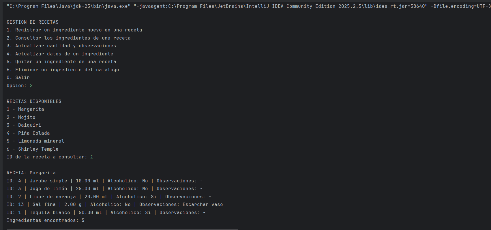

# Alchemy

Aplicación de consola en Java para administrar ingredientes de recetas de bebidas. La información se almacena en MySQL y la aplicación se conecta mediante JDBC.

## Funciones

1. Registrar un ingrediente nuevo y asociarlo a una receta existente.
2. Consultar los ingredientes de una receta.
3. Actualizar la cantidad y las observaciones de un ingrediente en una receta.
4. Actualizar el nombre, el tipo y la condición alcohólica de un ingrediente.
5. Quitar un ingrediente de una receta.
6. Eliminar un ingrediente del catálogo cuando ya no esté asociado a ninguna receta.

La opción `0` permite salir.

El CRUD se realiza sobre las tablas relacionadas `ingredientes` y `receta_ingrediente`. El registro de un ingrediente y su asociación se guardan en una misma transacción.

## Requisitos

- JDK 17.
- IntelliJ IDEA.
- Docker Desktop con Docker Compose.
- MySQL Connector/J. Para reconstruir el proyecto puede usarse la versión 8.4.0, disponible en los [archivos oficiales de MySQL](https://downloads.mysql.com/archives/c-j/).

## Archivos principales

| Archivo | Contenido |
| --- | --- |
| `src/AppRecetas.java` | Menú, consultas y operaciones CRUD. |
| `src/ConexionDB.java` | Configuración de la conexión JDBC. |
| `docker-compose.yml` | Configuración del contenedor de MySQL. |
| `sql/01_ddl.sql` | Creación de la base, tablas y restricciones. |
| `sql/02_datos.sql` | Datos para reconstruir la base. |
| `docs/consulta_join.png` | Captura de la consulta JOIN ejecutada en la aplicación. |

## Iniciar la base de datos

1. Descargar o clonar el repositorio.
2. Abrir Docker Desktop.
3. Abrir una terminal en la carpeta que contiene `docker-compose.yml` y ejecutar:

```powershell
docker compose up -d
```

4. Revisar el estado del servicio:

```powershell
docker compose ps
```

Esperar a que el contenedor `mysql_alchemy` aparezca como `healthy` antes de ejecutar la aplicación.

Al inicializar un volumen vacío, MySQL ejecuta primero `01_ddl.sql` y después `02_datos.sql`. Los datos se conservan en el volumen `alchemy_datos`.

## Ejecutar la aplicación

1. Abrir la carpeta del proyecto en IntelliJ IDEA.
2. Seleccionar JDK 17 en **File > Project Structure > Project > SDK**.
3. Si `src` no está marcado como carpeta de código fuente, hacer clic derecho sobre él y elegir **Mark Directory as > Sources Root**.
4. Crear la carpeta `lib` en la raíz del proyecto. Descargar Connector/J, seleccionar **Platform Independent**, extraer el archivo ZIP y copiar el JAR del conector a `lib`.
5. En IntelliJ, hacer clic derecho sobre el JAR y seleccionar **Add as Library** para agregarlo al módulo del proyecto.
6. Abrir `AppRecetas.java` y ejecutar su método `main`.

La conexión está definida en `src/ConexionDB.java` con estos valores para el entorno local:

| Configuración | Valor |
| --- | --- |
| Servidor | `localhost` |
| Puerto | `3308` |
| Base de datos | `alchemy` |
| Usuario | `root` |
| Contraseña | `root_password_clase` |

## Consulta JOIN

La opción 2 relaciona las recetas, sus ingredientes y las cantidades registradas:

```sql
SELECT r.nombre_receta, i.id_ingrediente, i.nombre_ingrediente,
       ri.cantidad, i.unidad_base, i.alcoholico, ri.observaciones
FROM receta_ingrediente ri
JOIN ingredientes i ON i.id_ingrediente = ri.id_ingrediente
JOIN recetas r ON r.id_receta = ri.id_receta
WHERE ri.id_receta = ?
ORDER BY i.nombre_ingrediente;
```

El parámetro `?` recibe el identificador de la receta mediante un `PreparedStatement`.



## Modelo de datos

La base contiene ocho tablas: `categorias`, `centros_consumo`, `ingredientes`, `recetas`, `versiones_receta`, `procedimientos`, `receta_ingrediente` y `carta_centro`.

La unidad base se guarda en `ingredientes`. La tabla `receta_ingrediente` guarda la cantidad y las observaciones correspondientes a cada asociación; su clave primaria está formada por `id_receta` e `id_ingrediente`.

## Detener la base de datos

```powershell
docker compose stop
```
